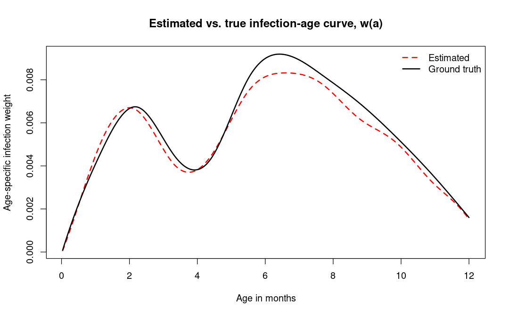
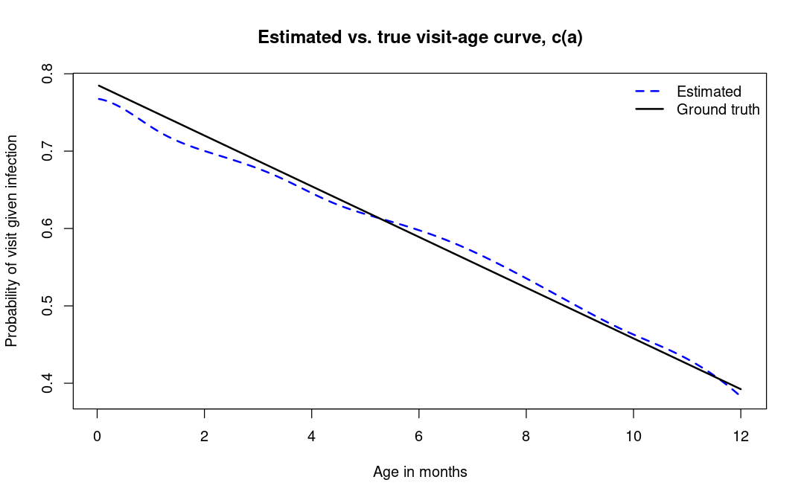

# Simulation Framework for Statistical Estimation

*Estimating hidden RSV infection patterns from birth timing and observed healthcare visits.*

The timing of a child's first respiratory syncytial virus (RSV) infection may be important for understanding later respiratory outcomes, including childhood wheeze and asthma. However, identifying the age of first infection is difficult because many infections are never directly observed, and only a subset lead to healthcare visits.

This project presents an end-to-end R workflow that uses birth timing and seasonal RSV activity to simulate first infections and observable healthcare visits during a child's first year of life. It then estimates two hidden age-related patterns: how the risk of first infection changes with age and how the probability that an infection leads to a healthcare visit changes with age.

Because the data are simulated, the underlying patterns are known and can be compared with the model's estimates after training. This provides a controlled way to evaluate how well the workflow recovers hidden processes from incomplete observations.

## Results

The reference example estimates two age-related patterns during a child's first year of life:

* How the risk of first RSV infection changes with age.
* How the probability that an infection leads to a healthcare visit changes with age.

The model is trained using simulated birth dates, seasonal RSV circulation, and whether a healthcare visit occurred. The known simulation curves are used to create reproducible starting points and to evaluate the results afterward, but they are not provided as targets for the model to match during training.



*The estimated infection-age curve closely follows the overall shape of the known simulation curve across the first year of life.*



*The estimated healthcare-visit curve also captures the broad age-related pattern, although larger local differences remain.*

### Reference run

The table below summarizes one reproducible run of the included example. Numerical results may vary slightly across R and package versions, operating systems, and hardware environments.

| Measure                               |      Result |
| ------------------------------------- | ----------: |
| Simulated subjects                    |      20,000 |
| Observed healthcare visits            |       5,989 |
| Observed visit rate                   |       29.9% |
| Mean probability of first infection by age one |       50.3% |
| Outer estimation iterations           |           3 |
| Approximate runtime                   | 7–8 minutes |


The estimated curves recover the broad age-related patterns used to generate the simulated data, with larger local differences for the healthcare-visit curve.

Additional recovery metrics and numerical validation results, including RMSE, maximum error, correlation, and probability-mass checks, are described in the [Technical Walkthrough](docs/technical_walkthrough.md).

## Why this problem is challenging

The age of a child's first RSV infection is usually hidden. Healthcare records capture only the infections that lead to a medical visit, so the event recorded in the data is not necessarily the event researchers want to understand.

Birth timing provides indirect information because RSV circulation changes throughout the year. Children born at different times reach the same age during different parts of the RSV season, which means they experience different infection risks even when they are the same age.

This creates a selective measurement problem: the model must use seasonal circulation, birth timing, and whether a healthcare visit occurred to learn about an infection process that is never directly observed. More broadly, the project demonstrates how statistical modeling can reveal hidden patterns when available records capture only a subset of the events of interest.

## From simulation to estimation

The reference example demonstrates the complete workflow from data generation through model evaluation.

1. **Build the model**
   Load the seasonal RSV circulation curve and define flexible age-related patterns for first-infection risk and the probability of a healthcare visit after infection.

2. **Simulate a population**
   Generate children with different birth dates. Each child's first year of life is aligned with a different portion of the RSV season, producing an individual pattern of exposure over age.

3. **Generate observed outcomes**
   Use the model's hidden first-infection process to simulate whether and when each child has an RSV-related healthcare visit during the first year of life. Children without a simulated visit are recorded as having no visit during that period.

4. **Train the model**
   Estimate the two hidden age-related patterns using birth dates, seasonal RSV circulation, and whether a healthcare visit occurred. The known curves are used to create reproducible starting points, but they are not provided as targets for the model to match.

5. **Evaluate recovery**
   Compare the estimated infection and healthcare-visit curves with the known curves used to generate the simulated data. This shows how well the model recovers the hidden patterns from the available information.

This structure separates data generation, model training, and evaluation, making each stage easier to inspect and validate.

## How the project was built

Building this workflow required combining statistical modeling, simulation, constrained optimization, and numerical validation. I developed the theoretical extension and independently designed, implemented, and validated the complete computational workflow in R.

The work spans three main areas:

### Translating a scientific problem into a model

* **Connecting hidden infections to observable data:** Developed a probability model linking seasonal RSV circulation, a child's first infection, and the possibility of a healthcare visit.
* **Creating realistic simulated data:** Designed synthetic populations in which the underlying infection and healthcare-visit patterns are known.
* **Representing flexible age-related patterns:** Used spline-based estimation so that the two curves could change smoothly with age without assuming a fixed shape.
* **Deriving the training objective:** Developed the likelihood and analytic gradients needed to train the model using both visit and no-visit outcomes.

### Building an efficient estimation process

* **Maintaining valid estimates:** Used constrained optimization to keep the estimated curves nonnegative.
* **Estimating two connected patterns:** Used an alternating procedure that updates one curve while temporarily holding the other fixed.
* **Reducing repeated computation:** Precomputed subject-level quantities that remain unchanged during training, improving the efficiency of repeated model evaluations.

### Validating and organizing the implementation

* **Checking mathematical and numerical correctness:** Used probability checks, gradient comparisons, convergence diagnostics, and recovery metrics.
* **Supporting reproducible results:** Used fixed random seeds, centralized configuration, and saved outputs.
* **Organizing the code into reusable components:** Separated model setup, probability calculations, training, simulation, and diagnostics into focused R modules.

## Quick start

### Requirements

* R
* The [`splines2`](https://cran.r-project.org/package=splines2) package

Install the required package if it is not already available:

```r
install.packages("splines2")
```

### Run the example

From a terminal opened in the project root, run:

```bash
Rscript run_example.R
```

Alternatively, open the project in an R environment such as RStudio, confirm that the working directory is the repository root, and run:

```r
source("run_example.R")
```

The complete workflow takes approximately **7–8 minutes** for the reference configuration, although runtime depends on the computer and execution environment.

During the run, the script prints progress updates, simulation summaries, training diagnostics, and recovery results to the console. By default, the recovery figures are saved in the `outputs/` directory.

## Expected output

During execution, the script reports progress for the main stages of the workflow, including:

* Model and simulation setup.
* Subject generation and precomputation.
* Healthcare-visit simulation.
* Model training.
* Convergence diagnostics.
* Curve-recovery summaries.
* Total runtime.

A successful run ends with a summary of the simulated data, the model's convergence status, and the agreement between the estimated and known curves.

When `save_plots = TRUE`, the following recovery figures are written to the `outputs/` directory:

* `infection_curve_recovery.png`
* `visit_curve_recovery.png`

## Repository structure

```text
.
├── README.md
├── run_example.R
├── R/
│   ├── model_setup.R
│   ├── probability_core.R
│   ├── likelihood.R
│   ├── estimation.R
│   ├── simulation.R
│   └── diagnostics.R
├── inputs/
├── outputs/
└── docs/
    ├── technical_walkthrough.md
    └── images/
        ├── infection_curve_recovery.png
        └── visit_curve_recovery.png
```

### Main components

* **`run_example.R`**
  Runs the complete reference workflow, from model setup and simulation through training and evaluation.

* **`R/model_setup.R`**
  Constructs the model, age-based curve representations, penalty matrices, and numerical settings.

* **`R/probability_core.R`**
  Implements the probability calculations connecting seasonal circulation, first-infection timing, and healthcare visits.

* **`R/likelihood.R`**
  Computes the visit and no-visit contributions used to train the model.

* **`R/estimation.R`**
  Contains the analytic gradients, training objectives, constrained optimization routines, and alternating estimation procedure.

* **`R/simulation.R`**
  Generates synthetic subjects and simulates healthcare-visit outcomes.

* **`R/diagnostics.R`**
  Produces validation checks, summaries, recovery metrics, and comparison plots.

* **`inputs/`**
  Stores the fixed seasonal circulation and curve-scaling inputs used by the reference example.

* **`outputs/`**
  Stores the recovery figures generated when plot saving is enabled.

* **`docs/`**
  Contains the technical walkthrough and the reference figures displayed in the README.

## Scope and limitations

This repository provides a focused, reproducible demonstration of the workflow rather than a comprehensive simulation study or a general-purpose R package.

* The example uses simulated data and one reference configuration, allowing the estimated curves to be compared with known patterns.
* The smoothing parameter is fixed, and training begins from reproducibly perturbed starting values derived from the simulation setup.
* Cross-validation, uncertainty intervals, and evaluation across many configurations are outside the scope of this public version.
* The results demonstrate recovery for the included example but should not be interpreted as performance guarantees for other datasets or settings.
* The repository presents the core modeling and computational extension rather than every component of the broader research project.
* Applying the framework to real data would require additional preparation and validation.

These choices keep the example practical to run while preserving the main simulation, training, optimization, and validation workflow.

## Project background and development

This project builds on an RSV infection-timing model introduced by McKennan et al. The original framework uses birth timing, seasonal RSV circulation, and infection-surveillance data to estimate the age of first infection.

The work presented here addresses a more challenging partially observed setting in which infection times are unknown and only a subset of infections appear as healthcare visits. I developed the additional age-dependent healthcare-visit component, the joint likelihood, and the model-training procedure.

I also independently designed and implemented the complete computational pipeline, including the simulation framework, estimation routines, numerical validation tools, diagnostics, and repository structure. The implementation was developed specifically for the extended model and does not reuse code from the foundational study.

### Foundational research

McKennan, C. G., Gebretsadik, T., Brunwasser, S. M. et al. "Predicting age of respiratory syncytial virus infection from birth timing." *Nature Communications* 17, 1178 (2026). https://doi.org/10.1038/s41467-025-67947-3

## Technical walkthrough

For a deeper explanation of the model, simulation process, probability calculations, training procedure, and validation strategy, see the [Technical Walkthrough](docs/technical_walkthrough.md).

The walkthrough connects the mathematical formulation to the implementation and explains how the main source files work together.

## Author

**Manuel Garcia Acosta, PhD**

Statistician focused on data science, machine learning, and quantitative modeling.

[LinkedIn](https://www.linkedin.com/in/manuel-garcia-acosta/) · [GitHub](https://github.com/manuelgacos)
